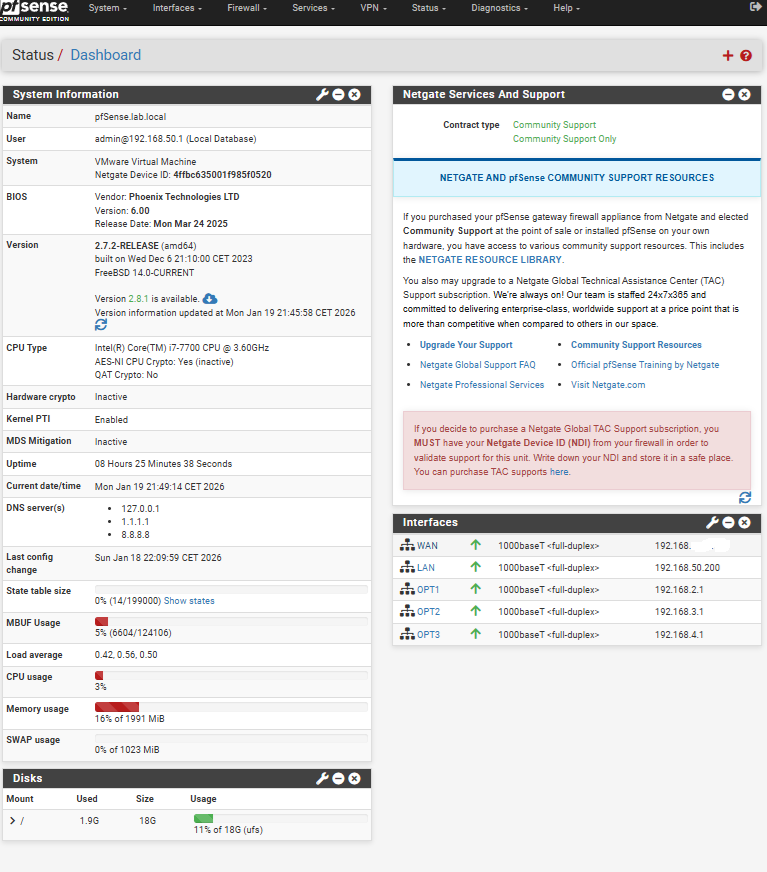
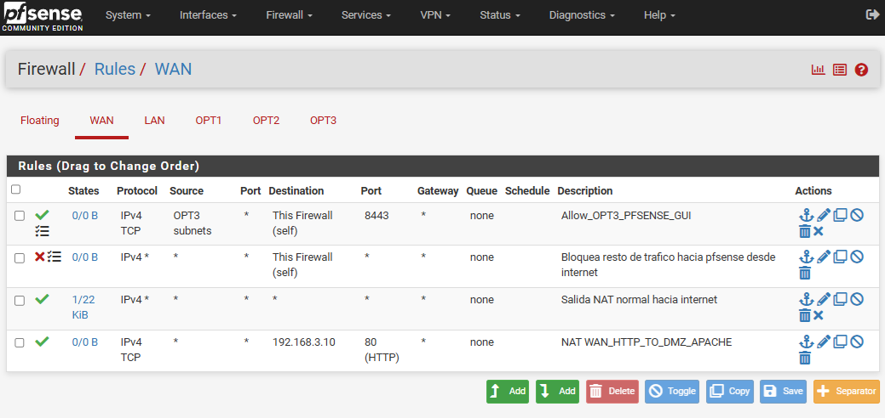
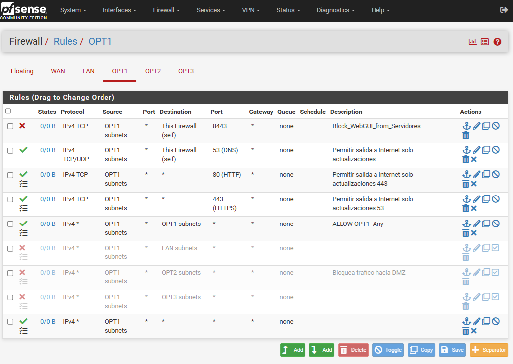
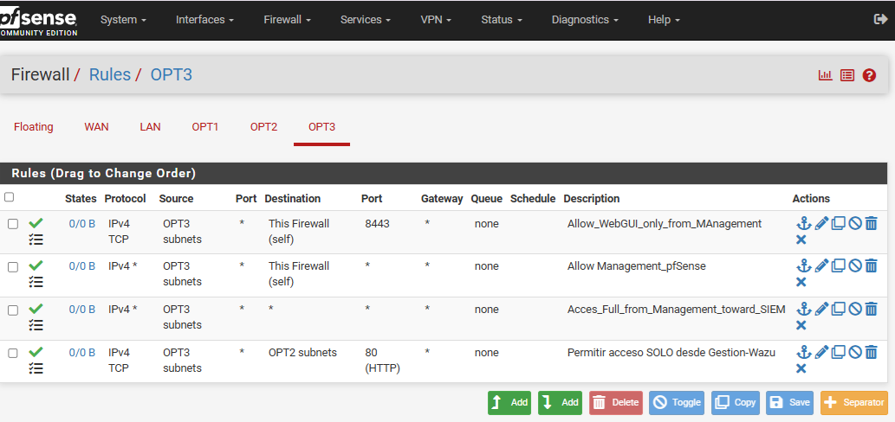

# SECURITYX
Enterprise network security lab using pfSense, IDS Suricata and segmented networks
## Documentación Técnica
- [Diseño de Red](documentation/network_design.md)
- [Configuración de Seguridad](documentation/security_configuration.md)
## Evidencias del Laboratorio

### Dashboard pfSense

### Reglas de Firewall – LAN

### Reglas de Firewall – WAN

### Reglas de Firewall – Servidores (OPT1)

### Reglas de Firewall – DMZ (OPT2)

### Reglas de Firewall – Gestión (OPT3)

### IDS – Suricata

